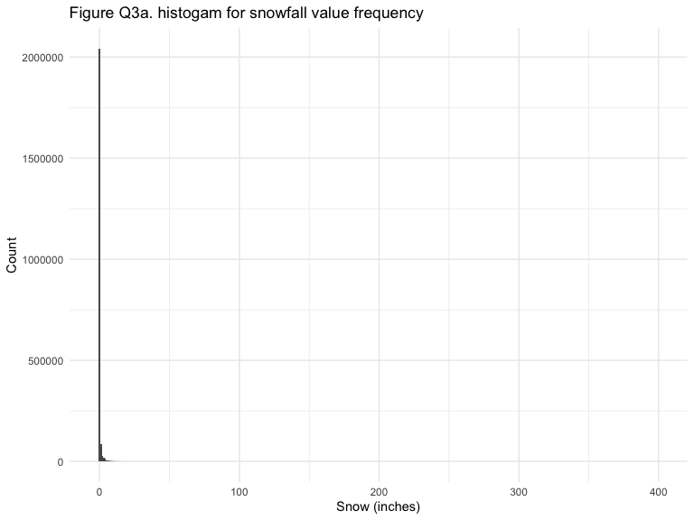

p1805_hw3_jc5457
================

### Problem 1

#### Read in the data

``` r
data("instacart")

instacart = 
  instacart %>% 
  as_tibble(instacart)
```

#### Answer questions about the data

This dataset contains 1384617 rows and 15 columns, with each row
resprenting a single product from an instacart order. Variables include
identifiers for user, order, and product; the order in which each
product was added to the cart. There are several order-level variables,
describing the day and time of the order, and number of days since prior
order. Then there are several item-specific variables, describing the
product name (e.g. Yogurt, Avocado), department (e.g. dairy and eggs,
produce), and aisle (e.g. yogurt, fresh fruits), and whether the item
has been ordered by this user in the past. In total, there are 39123
products found in 131209 orders from 131209 distinct users.

Below is a table summarizing the number of items ordered from aisle. In
total, there are 134 aisles, with fresh vegetables and fresh fruits
holding the most items ordered by far.

``` r
instacart %>% 
  count(aisle) %>% 
  arrange(desc(n))
```

    ## # A tibble: 134 × 2
    ##    aisle                              n
    ##    <chr>                          <int>
    ##  1 fresh vegetables              150609
    ##  2 fresh fruits                  150473
    ##  3 packaged vegetables fruits     78493
    ##  4 yogurt                         55240
    ##  5 packaged cheese                41699
    ##  6 water seltzer sparkling water  36617
    ##  7 milk                           32644
    ##  8 chips pretzels                 31269
    ##  9 soy lactosefree                26240
    ## 10 bread                          23635
    ## # … with 124 more rows

Next is a plot that shows the number of items ordered in each aisle.
Here, aisles are ordered by ascending number of items.

``` r
instacart %>% 
  count(aisle) %>% 
  filter(n > 10000) %>% 
  mutate(aisle = fct_reorder(aisle, n)) %>% 
  ggplot(aes(x = aisle, y = n)) + 
  geom_point() + 
  labs(title = "Number of items ordered in each aisle") +
  theme(axis.text.x = element_text(angle = 60, hjust = 1))
```


Our next table shows the three most popular items in aisles
`baking ingredients`, `dog food care`, and `packaged vegetables fruits`,
and includes the number of times each item is ordered in your table.

``` r
instacart %>% 
  filter(aisle %in% c("baking ingredients", "dog food care", "packaged vegetables fruits")) %>%
  group_by(aisle) %>% 
  count(product_name) %>% 
  mutate(rank = min_rank(desc(n))) %>% 
  filter(rank < 4) %>% 
  arrange(desc(n)) %>%
  knitr::kable()
```

| aisle                      | product_name                                  |    n | rank |
|:---------------------------|:----------------------------------------------|-----:|-----:|
| packaged vegetables fruits | Organic Baby Spinach                          | 9784 |    1 |
| packaged vegetables fruits | Organic Raspberries                           | 5546 |    2 |
| packaged vegetables fruits | Organic Blueberries                           | 4966 |    3 |
| baking ingredients         | Light Brown Sugar                             |  499 |    1 |
| baking ingredients         | Pure Baking Soda                              |  387 |    2 |
| baking ingredients         | Cane Sugar                                    |  336 |    3 |
| dog food care              | Snack Sticks Chicken & Rice Recipe Dog Treats |   30 |    1 |
| dog food care              | Organix Chicken & Brown Rice Recipe           |   28 |    2 |
| dog food care              | Small Dog Biscuits                            |   26 |    3 |

Finally is a table showing the mean hour of the day at which Pink Lady
Apples and Coffee Ice Cream are ordered on each day of the week. This
table has been formatted in an untidy manner for human readers. Pink
Lady Apples are generally purchased slightly earlier in the day than
Coffee Ice Cream, with the exception of day 5.

``` r
instacart %>%
  filter(product_name %in% c("Pink Lady Apples", "Coffee Ice Cream")) %>%
  group_by(product_name, order_dow) %>%
  summarize(mean_hour = mean(order_hour_of_day)) %>%
  spread(key = order_dow, value = mean_hour) %>%
  knitr::kable(digits = 2)
```

    ## `summarise()` has grouped output by 'product_name'. You can override using the
    ## `.groups` argument.

| product_name     |     0 |     1 |     2 |     3 |     4 |     5 |     6 |
|:-----------------|------:|------:|------:|------:|------:|------:|------:|
| Coffee Ice Cream | 13.77 | 14.32 | 15.38 | 15.32 | 15.22 | 12.26 | 13.83 |
| Pink Lady Apples | 13.44 | 11.36 | 11.70 | 14.25 | 11.55 | 12.78 | 11.94 |

### Problem 2

#### Load and clean the data

``` r
accel_df =
  read_csv("data/accel_data.csv") %>% 
  janitor::clean_names() %>% 
  mutate(day = factor(day))
```

    ## Rows: 35 Columns: 1443
    ## ── Column specification ────────────────────────────────────────────────────────
    ## Delimiter: ","
    ## chr    (1): day
    ## dbl (1442): week, day_id, activity.1, activity.2, activity.3, activity.4, ac...
    ## 
    ## ℹ Use `spec()` to retrieve the full column specification for this data.
    ## ℹ Specify the column types or set `show_col_types = FALSE` to quiet this message.

#### Describe the resulting dataset

There are 35 observations and 1443 variables in this dataset. The
variables are `week`, `day_id`, `day`, and 1440 activity variables
`activity_1`, `activity_2`… `activity_1440`.

#### Traditional analyses of accelerometer data focus on the total activity over the day.

Here we use the tidied dataset, aggregate across minutes to create a
total activity variable for each day, and create a table showing these
totals.

``` r
accel_df %>% 
  mutate(total_activity = sum(accel_df[4:1443])) %>% 
  subset(select = c("week","day_id","day","total_activity" )) %>% 
  knitr::kable(digits = 2)
```

| week | day_id | day       | total_activity |
|-----:|-------:|:----------|---------------:|
|    1 |      1 | Friday    |       13459021 |
|    1 |      2 | Monday    |       13459021 |
|    1 |      3 | Saturday  |       13459021 |
|    1 |      4 | Sunday    |       13459021 |
|    1 |      5 | Thursday  |       13459021 |
|    1 |      6 | Tuesday   |       13459021 |
|    1 |      7 | Wednesday |       13459021 |
|    2 |      8 | Friday    |       13459021 |
|    2 |      9 | Monday    |       13459021 |
|    2 |     10 | Saturday  |       13459021 |
|    2 |     11 | Sunday    |       13459021 |
|    2 |     12 | Thursday  |       13459021 |
|    2 |     13 | Tuesday   |       13459021 |
|    2 |     14 | Wednesday |       13459021 |
|    3 |     15 | Friday    |       13459021 |
|    3 |     16 | Monday    |       13459021 |
|    3 |     17 | Saturday  |       13459021 |
|    3 |     18 | Sunday    |       13459021 |
|    3 |     19 | Thursday  |       13459021 |
|    3 |     20 | Tuesday   |       13459021 |
|    3 |     21 | Wednesday |       13459021 |
|    4 |     22 | Friday    |       13459021 |
|    4 |     23 | Monday    |       13459021 |
|    4 |     24 | Saturday  |       13459021 |
|    4 |     25 | Sunday    |       13459021 |
|    4 |     26 | Thursday  |       13459021 |
|    4 |     27 | Tuesday   |       13459021 |
|    4 |     28 | Wednesday |       13459021 |
|    5 |     29 | Friday    |       13459021 |
|    5 |     30 | Monday    |       13459021 |
|    5 |     31 | Saturday  |       13459021 |
|    5 |     32 | Sunday    |       13459021 |
|    5 |     33 | Thursday  |       13459021 |
|    5 |     34 | Tuesday   |       13459021 |
|    5 |     35 | Wednesday |       13459021 |

Trend: The total activity in each day through five weeks are all the
same.

#### Making plot

Accelerometer data allows the inspection activity over the course of the
day. Here we make a single-panel plot that shows the 24-hour activity
time courses for each day and use color to indicate day of the week.

``` r
accel_df %>%
  pivot_longer(
    activity_1:activity_1440, 
    names_to = "activity", 
    values_to = "activity_count_per_minute") %>%
  mutate(activity = factor(activity)
         ) %>% 
  ggplot(aes(x = day_id, 
             y = activity_count_per_minute, 
             colour = day_id)) +
  geom_point()
```


The graph shows that this person mainly had their activity count per
minute below 2500.

### Problem 3

#### Load the data

``` r
library(p8105.datasets)
data("ny_noaa")
```

#### Describe the data

This dataset contains 2595176 rows and 7 columns, describing the five
core variables for all New York state weather stations from January 1,
1981 through December 31, 2010.

Key variables include:

-   `id`: Weather station ID, with 0% of missing value.
-   `date`: Date of observation, with 0% of missing value.
-   `prcp`: Precipitation (tenths of mm), with 5.6195803% of missing
    value.
-   `snow`: Snowfall (mm), with 14.689601% of missing value.
-   `snwd`: Snow depth (mm), with 22.8033089% of missing value.
-   `tmax`: Maximum temperature (tenths of degrees C), with 43.7102532%
    of missing value.
-   `tmin`: Minimum temperature (tenths of degrees C), with 43.7126422%
    of missing value.

#### Do some data cleaning.

Here we create separate variables for year, month, and day.

Then, transfer the unit of observations:

-   temperature (0.1 degrees C to F),
-   precipitation (0.1 mm to inch),
-   snowfall (mm to inch)

``` r
noaa_tidy <- ny_noaa %>% 
  separate(date, sep="-", into = c("year","month","day")) %>% 
  mutate(year = as.numeric(year), 
         month = as.numeric(month), 
         day = as.numeric(day),
         prcp = as.integer(round(prcp*.1*0.03937008)),
         snow = as.integer(round(snow*0.03937008)),
         snwd = as.integer(round(snwd*0.03937008)),
         tmax = as.integer(round(as.numeric(tmax)*.1*1.8+32)),
         tmin = as.integer(round(as.numeric(tmin)*.1*1.8+32))
         )

str(noaa_tidy)
```

    ## tibble [2,595,176 × 9] (S3: tbl_df/tbl/data.frame)
    ##  $ id   : chr [1:2595176] "US1NYAB0001" "US1NYAB0001" "US1NYAB0001" "US1NYAB0001" ...
    ##  $ year : num [1:2595176] 2007 2007 2007 2007 2007 ...
    ##  $ month: num [1:2595176] 11 11 11 11 11 11 11 11 11 11 ...
    ##  $ day  : num [1:2595176] 1 2 3 4 5 6 7 8 9 10 ...
    ##  $ prcp : int [1:2595176] NA NA NA NA NA NA NA NA NA NA ...
    ##  $ snow : int [1:2595176] NA NA NA NA NA NA NA NA NA NA ...
    ##  $ snwd : int [1:2595176] NA NA NA NA NA NA NA NA NA NA ...
    ##  $ tmax : int [1:2595176] NA NA NA NA NA NA NA NA NA NA ...
    ##  $ tmin : int [1:2595176] NA NA NA NA NA NA NA NA NA NA ...

``` r
snowfall_hist = noaa_tidy %>%
  ggplot(aes(x = snow)) + 
    geom_histogram(binwidth=10,na.rm=TRUE) +
    labs(
    title = "Figure Q3a. histogam for snowfall values",
    x = "Snow (inches)",
    y = "Count")
snowfall_hist
```



For snowfall, the most commonly observed values are? Why?

#### Make a two-panel plot

Make a two-panel plot showing the average max temperature in January and
in July in each station across years. Is there any observable /
interpretable structure? Any outliers?

#### Make another two-panel plot

Make a two-panel plot showing (i) tmax vs tmin for the full dataset
(note that a scatterplot may not be the best option); and (ii) make a
plot showing the distribution of snowfall values greater than 0 and less
than 100 separately by year.
